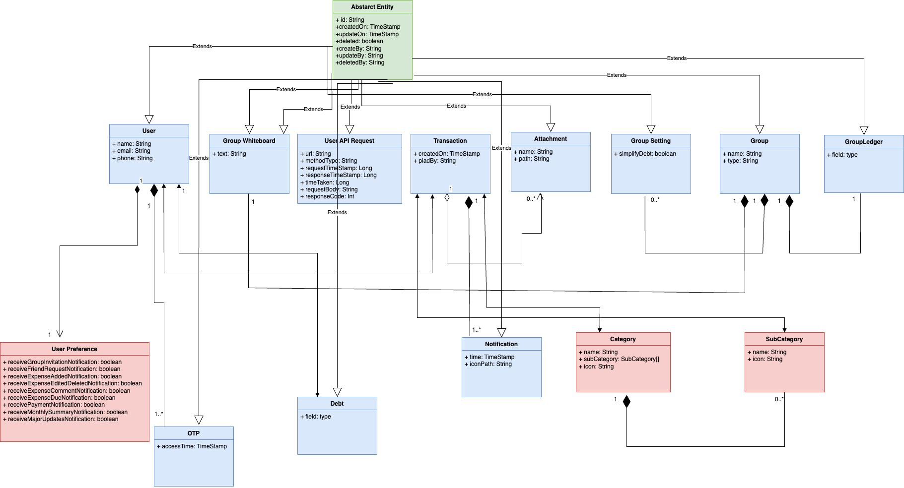

# FairShare
### Split expenses with friends effortlessly. The easy way to share costs and settle balances

FairShare is a web app that allows easy splitting of expenses between friends. Easily keep track of shared expenses, balances, and who owes who money.

FairShare helps groups of friends track shared expenses for trips, dinners, shared apartments and more. Users can easily add expenses like restaurants bills, rent, utilities and  evenly split or divided based on shares. Splits can be equal or uneven. Payments between users are also tracked to keep balances up to date.

## Key features include:

- Share expenses with friends and groups
- Split expenses evenly or unequally
- Add expenses easily via website or through excel all at once 
- Track balances and payments
- Pay back friends and settle up
- Notification reminders for payments owed through email
- International support for languages

FairShare assurances to reduce the friction associated with sharing expenditures and to eliminate unpaid obligations amongst friends. The webapp has a simple, user-friendly design with additional statistics and trends.

## Dashboard

The main dashboard view shows recent activity, balances owed/owing and recent expenses.
From the dashboard users can quickly add expenses, record payments and view activity.

## Features

### User Profile
- Sign up with Email
- Profile with photo, bio, email and phone  
- Secure password login
- Reset password via email
- Receive notifications via email, SMS or in-app

### Expenses
Expenses may be effortlessly uploaded via the web or through an Excel spreadsheet all at once.

Key expense features:
- Upload photos of receipts
- Enter amount and merchant 
- Select payer from group
- Split evenly or unevenly
- Categorize 
  - Tag friends involved
  - Add notes
  - View all expenses in feed or list
  - Edit and delete expenses
- Export expenses to Excel, PDF etc.

Expenses feed shows recent expenses. Can filter by friend, group or type.

### Balances 
Balances tab shows total owed/owing with breakdown by friend and group. Shows historical chart of balances over time.
The balances clearly indicate who owes who and by how much and futher can be setteled up.

### Groups
Groups allow friends to track expenses and balances for trips, apartments, events and more.

- Create/join groups via invite link
- Add/remove members from group
- Leave groups
- View group balances between members
- Group profiles with member list and balances
- When creating a group:
   - Define a group name.
   - Add group members.

### Friends
Friends can be added and can be tagged in expenses and can view balances breakdown by friend.

### Payments And Expense Settelments
 
Payments made between group members are tracked. 
Users can view their balances within each group and record payment sent or received and mark as paid.

### Notifications
Email Notifications for

- Payment reminders
- Group invites 
- Balance updates
- Expenses added/removed

Email Notifications keep users engaged and ensure debts get settled up in timely manner.

### Search 
Search enables the discovery of spending, groups, and non-groups. Filtering and sorting by amount, date, friends, group members, groups, and particular spending and transactions is possible.
